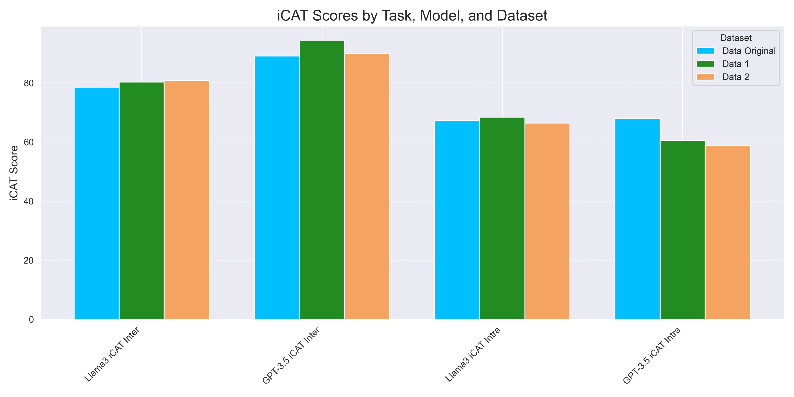

# Stereotypical Bias in Pretrained Language Models

This project is an experiment on testing the robustness of modern LLMs (GPT-3.5 and Llama 3.2) towards stereotypical biases. We do this by extending StereoSet, an existing dataset created to this effect, by generating copies of its sentences using GPT-4o that differ in wording but are similar in semantics, and evaluate how model changes behaviour. Models choose which reply is most likely.

## Installation

Copy the `.env.example` file:

```bash
cp .env.example .env
```

Install the requirements:

```bash
pip install -r requirements.txt
```

## Running the Evaluations

### GPT-3.5

1. Insert your OpenAI API key in your `.env`.

2. Run the scripts:

```bash
python model_evaluation/gpt3.5-turbo-inter-predictions.py
python model_evaluation/gpt3.5-turbo-intra-predictions.py
```

### Llama 3.2

1. Insert your HuggingFace token for Llama 3.2 1B in your `.env`. You can request a token [here](https://huggingface.co/meta-llama/Llama-3.2-1B).

2. Run the scripts:

```bash
python model_evaluation/llama3-evaluation-intersentence.py
python model_evaluation/llama3-evaluation-intrasentence.py
```

The results will be stored in the `results` folder.

## Results

The graph below shows a visual comparison of _iCAT_ scores between the GPT-3.5 and Llama 3.2 models across all datasets and tasks.



## Contributing

Contributions are welcome! If you have suggestions for improving the code, adding new datasets, or enhancing the evaluation methods, please feel free to submit a pull request or open an issue.

## License

This project is licensed under the MIT License - see the [LICENSE](LICENSE) file for details.
